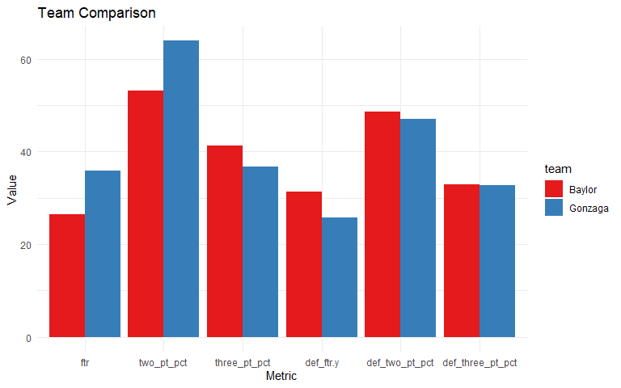

<!-- README.md is generated from README.Rmd. Please edit that file -->

# finalfourr

<!-- badges: start -->
<!-- badges: end -->

The goal of finalfourr is to provide an accessible and powerful
framework for analyzing NCAA men’s basketball, with a primary focus on
predicting Sweet Sixteen teams and supporting deeper insights through
simulation, comparison, and visualization tools.

## Installation Instructions:

In order to install the finalfourr package you must first install the
cbbdata package then install finalfourr:

``` r
devtools::install_github("andreweatherman/cbbdata")
devtools::install_github("ZayneHMaughan/finalfourr")
```

Secondly, you need an API key to query data from the cbbdata package.

``` r

cbbdata::cbd_create_account(username, email, password, confirm_password)
```

## Core Functionality

`predict_s16_teams(year)`

Predicts which teams would make the Sweet Sixteen using an XGBoost model
trained on season statistics from 2008–2023.

- Uses SMOTE to address class imbalance.

- Returns a ranked list of 16 predicted teams.

- Example:

``` r
predict_s16_teams(2020)
#> # A tibble: 16 × 2
#> # Groups:   team [16]
#>    team          probs
#>    <fct>         <dbl>
#>  1 Duke          1.00 
#>  2 Dayton        1.00 
#>  3 Kansas        0.999
#>  4 Gonzaga       0.996
#>  5 Michigan St.  0.995
#>  6 Florida St.   0.994
#>  7 Baylor        0.991
#>  8 Louisville    0.988
#>  9 Creighton     0.962
#> 10 Ohio St.      0.962
#> 11 San Diego St. 0.923
#> 12 Villanova     0.920
#> 13 Michigan      0.914
#> 14 Oregon        0.912
#> 15 West Virginia 0.852
#> 16 Seton Hall    0.847
```

## Data Exploration Tools

### Search Teams by Keyword

``` r
search_team("utah", include_years = TRUE)
#> # A tibble: 5 × 2
#>   team          years                                                           
#>   <chr>         <chr>                                                           
#> 1 Southern Utah 2013, 2014, 2015, 2016, 2017, 2018, 2019, 2020, 2021, 2022, 202…
#> 2 Utah          2013, 2014, 2015, 2016, 2017, 2018, 2019, 2020, 2021, 2022, 202…
#> 3 Utah St.      2013, 2014, 2015, 2016, 2017, 2018, 2019, 2020, 2021, 2022, 202…
#> 4 Utah Tech     2021, 2022, 2023, 2024                                          
#> 5 Utah Valley   2013, 2014, 2015, 2016, 2017, 2018, 2019, 2020, 2021, 2022, 202…
```

### Compare Two Teams

``` r
comparison <- compare_teams(2021, "Gonzaga", "Baylor")
comparison
#> # A tibble: 2 × 7
#> # Groups:   team [2]
#>   team     ftr two_pt_pct three_pt_pct def_ftr.y def_two_pt_pct def_three_pt_pct
#>   <chr>  <dbl>      <dbl>        <dbl>     <dbl>          <dbl>            <dbl>
#> 1 Gonza…  35.8       63.9         36.8      25.7           47               32.7
#> 2 Baylor  26.5       53.2         41.3      31.3           48.7             32.9
```

``` r
plot_compare_teams(comparison)
```



### Get Teams by Conference

``` r
conf_teams <- get_teams_by_conf(2018)
names(conf_teams) # List of conference names
#>  [1] "A10"  "ACC"  "AE"   "Amer" "ASun" "B10"  "B12"  "BE"   "BSky" "BSth"
#> [11] "BW"   "CAA"  "CUSA" "Horz" "Ivy"  "MAAC" "MAC"  "MEAC" "MVC"  "MWC" 
#> [21] "NEC"  "OVC"  "P12"  "Pat"  "SB"   "SC"   "SEC"  "Slnd" "Sum"  "SWAC"
#> [31] "WAC"  "WCC"
head(conf_teams$`B10`) # Teams in the Big Ten
#> [1] "Illinois"     "Indiana"      "Iowa"         "Maryland"     "Michigan"    
#> [6] "Michigan St."
```

## Simulations and Utilities

### Simulate Matchup

``` r
set.seed(385)
simulate_matchup("Utah", "Baylor", 2015)
#> 
#> Year: 2015
#> Utah vs Baylor
#> 
#> Utah Wins: 698 (69.8%)
#> Baylor Wins: 302 (30.2%)
#> 
#> Winner: Utah
```

### Filter Team Stats

``` r
filter_team("N.C. State", season = 2016)
#> # A tibble: 1 × 84
#> # Groups:   team [1]
#>   team        year   min   pos   fgm   fga fg_pct   tpm   tpa tp_pct   ftm   fta
#>   <chr>      <dbl> <dbl> <dbl> <dbl> <dbl>  <dbl> <dbl> <dbl>  <dbl> <dbl> <dbl>
#> 1 N.C. State  2016  201.  68.6  27.5  61.2  0.449  7.15  18.9  0.373  15.2  21.9
#> # ℹ 72 more variables: oreb <dbl>, dreb <dbl>, reb <dbl>, ast <dbl>, stl <dbl>,
#> #   blk <dbl>, to <dbl>, pf <dbl>, pts <dbl>, opp_fgm <dbl>, opp_fga <dbl>,
#> #   opp_fg_pct <dbl>, opp_tpm <dbl>, opp_tpa <dbl>, opp_tp_pct <dbl>,
#> #   opp_ftm <dbl>, opp_fta <dbl>, opp_ft_pct <dbl>, opp_oreb <dbl>,
#> #   opp_dreb <dbl>, opp_reb <dbl>, opp_ast <dbl>, opp_stl <dbl>, opp_blk <dbl>,
#> #   opp_to <dbl>, opp_pf <dbl>, opp_pts <dbl>, pts_scored <dbl>,
#> #   pts_allowed <dbl>, adj_o.x <dbl>, adj_d.x <dbl>, off_ppp <dbl>, …
```

## Conclusion

The finalfourr package enables analysts, data scientists, and fans to:

- Predict NCAA tournament outcomes.

- Explore team performance trends.

- Simulate realistic game scenarios.

It offers both rigorous modeling and exploratory tools to deepen your
understanding of NCAA men’s basketball.
